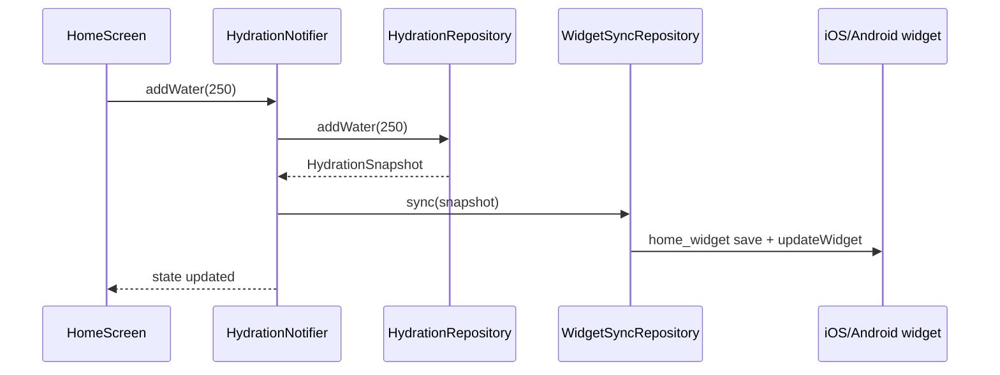

# Water Reminder — architecture

## Stack choice: **Riverpod 2**

| Option | Verdict |
|--------|---------|
| **Riverpod** | Selected. Testable DI, `AsyncNotifier` for load/add/sync, easy overrides in tests. |
| BLoC | Heavier boilerplate for a small app; fine if the team standardizes on it later. |
| Provider | Too low-level for async hydration + widget side effects. |

## Layers

```
presentation  →  application  →  domain  ←  data
 (Widgets)        (Riverpod)     (entities,     (prefs, home_widget)
                                   contracts)
```

### Domain (`lib/domain/`)

- **`HydrationSnapshot`** — immutable daily state (goal, intake, progress).
- **`HydrationRepository`** — contract: load, addWater, setGoal, resetToday.
- **`WidgetSyncRepository`** — contract: push snapshot to native widgets.

No Flutter / `shared_preferences` / `home_widget` imports here.

### Data (`lib/data/`)

- **`HydrationPrefsStore`** — reads/writes `SharedPreferences`.
- **`HydrationRepositoryImpl`** — implements `HydrationRepository`.
- **`HomeWidgetSyncRepository`** — implements `WidgetSyncRepository` via `home_widget` + `WidgetDataKeys`.

Native iOS (WidgetKit) and Android (`HomeWidgetProvider`) read the **same keys** from shared storage (App Group / widget SharedPreferences).

### Application (`lib/features/hydration/application/`)

- **`HydrationNotifier`** (`AsyncNotifier<HydrationSnapshot>`) — single source of truth for UI.
- On every mutation: persist → update `state` → `widgetSync.sync(snapshot)`.

### Presentation (`lib/features/home/`, `settings/`)

- Dumb widgets; only `ref.watch` / `ref.read` the notifier.

### DI (`lib/core/di/providers.dart`)

- All `Provider` / `AsyncNotifierProvider` definitions in one place.

## Data flow (add water)



## Widget contract

See `lib/data/widget/widget_data_keys.dart` and `docs/widgets.md`.
